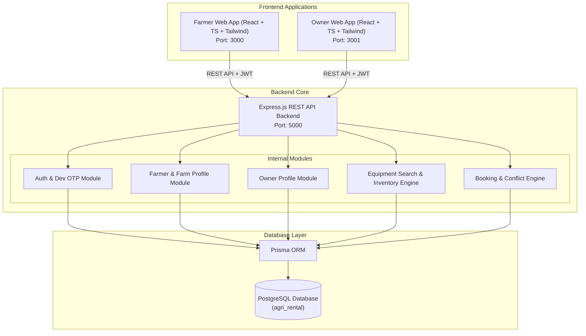
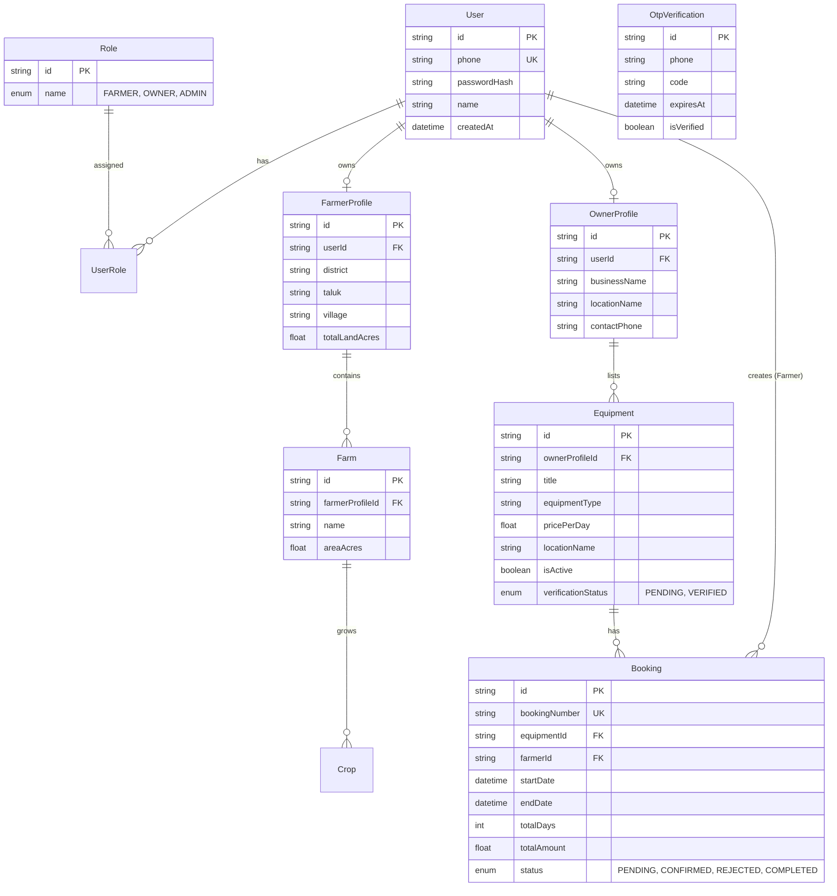
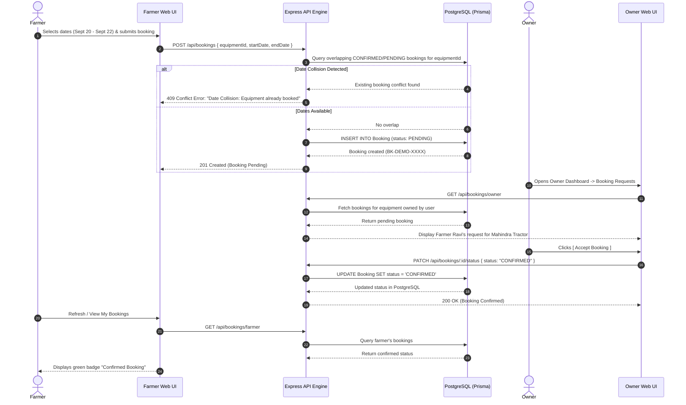

# System Architecture & Design Document

## Asset-Light Farming: Optimizing Operational Costs through Managed Equipment Access

---

## 1. High-Level Architecture Overview

The system is engineered as a **Modular Monolith** supporting a two-sided marketplace for agricultural machinery rentals.



---

## 2. Database Entity Relationship Diagram (ERD)



---

## 3. Booking & Conflict Validation Sequence Diagram



---

## 4. Distance Awareness & Extensibility

```mermaid
graph LR
    subgraph Current Implementation (MVP)
        LocalCoords["Local Coordinates / Address Input"] --> Haversine["Haversine Formula Engine"]
        Haversine --> DistanceKm["Calculates Straight-Line Distance (km)"]
    end

    subgraph Future Integration Phase
        DistanceKm -.-> GoogleMapsMatrix["Google Maps Distance Matrix API"]
        GoogleMapsMatrix -.-> TransportPricing["Distance-Based Transport & Pricing Engine"]
    end
```
